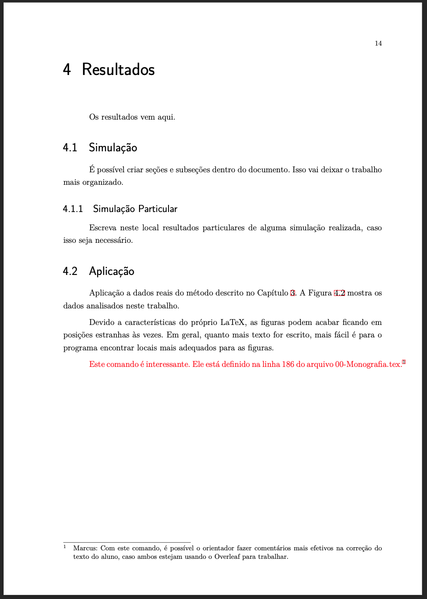

## Monografia UFRN

**Modelo atualizado em 30/01/2022**

Esta é uma sugestão de modelo de monografia baseada nas normas da ABNT, baseada nos arquivos originais 

    abtex2-modelo-trabalho-academico.tex, v-1.9.6 laurocesar
    Copyright 2012-2016 by abnTeX2 group at http://www.abntex.net.br/ 

Modificado por Marcus Nunes - [site pessoal](https://marcusnunes.me/) e [github](https://github.com/mnunes/) -  para se adequar às exigências do Departamento de Estatística da Universidade Federal do Rio Grande do Norte (UFRN). Baseado no trabalho do grupo [http://www.abntex.net.br/](http://www.abntex.net.br/).

Para fins de organização, cada capítulo da monografia foi colocado em um arquivo `.tex` diferente. Edite cada um deles de acordo com o texto do seu trabalho e compile apenas o arquivo `00-Monografia.tex` para ver o resultado final do documento.

## Software Indicado

Há diversas maneiras de editar um documento escrito em LaTeX. Cada sistema operacional possui as suas peculiaridades. Atualmente indico o site [Overleaf](https://www.overleaf.com/) para quem deseja editar arquivos neste formato. É uma ferramenta online com todos os recursos de uma distribuição LaTeX offline, poupando as dores de cabeça que uma instalação local sempre gera.

Sendo direto, o [Overleaf](https://www.overleaf.com/) é como um Google Docs para LaTeX. Basta criar uma conta lá e começar a escrever. Eu recomendo essa opção pela praticidade na edição do documento e no compartilhamento dos resultados.

## Dica para edição da monografia

Esta nova versão possui uma alteração em seu arquivo `00-Monografia.tex`. O código abaixo está presente na linha 186 desse arquivo:

    \newcommand{\marcus}[2]{\textcolor{red}{#1}\footnote{Marcus: #2}\xspace}

Com ele, é possível destacar trechos da monografia para que o aluno os corrija ou os desenvolva melhor, sem precisar anotar diretamente no pdf. Veja no exemplo abaixo como fica o resultado no arquivo compilado:

Em minha experiência pessoal, isso dinamizou o fluxo de trabalho, deixando as edições da monografia mais ágeis. O orientador pode alterar o atalho `\marcus` e o texto `Marcus` para o seu próprio, de modo a personalizar seu trabalho. Caso haja mais de um orientador, é possível copiar e alterar adequadamente o código acima, com nomes e cores, de modo que hajam anotações individuais de cada um dos professores.

Essa foi uma dica de [Leonardo Bezerra](https://github.com/leobezerra).

---

This work may be distributed and/or modified under the
conditions of the LaTeX Project Public License, either version 1.3
of this license or (at your option) any later version.
The latest version of this license is in
  http://www.latex-project.org/lppl.txt
and version 1.3 or later is part of all distributions of LaTeX
version 2005/12/01 or later.

This work has the LPPL maintenance status `maintained'.

The Current Maintainer of this work is the abnTeX2 team, led
by Lauro César Araujo. Further information are available on 
[http://www.abntex.net.br/](http://www.abntex.net.br/).
